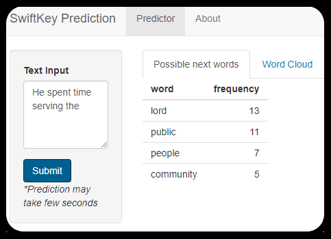

```{r setup, include=FALSE}
knitr::opts_chunk$set(echo = FALSE)
```

## Introduction

This is a presentation for the Data Science Specialization (Coursera) capstone project. The goal is to build a prediction model that predicts the next word, given a phrase.  
Based on a dataset of texts, a basic model has been built and deployed as a Shiny Application : [SwiftKey Prediction](https://eranda-i.shinyapps.io/SwiftKey_Prediction_1_0/)


```{r, }

```

<center>
```{r, echo=FALSE, out.width="50%", fig.cap="Snapshot of app"}

```
</center>

## Data Sources

The datasets used in this project can be found here: [Coursera-SwiftKey.zip](https://d396qusza40orc.cloudfront.net/dsscapstone/dataset/Coursera-SwiftKey.zip)

This dataset is fairly large and contains text data that have been collected from 3 types of websites:

-   Blogs
-   News
-   Twitter

Although the dataset contains 4 languages, here we are taking English dataset for the project.

## Data Processing
<p style="margin-top: -40px;">
Main considerations during the processing of data are as follows: 
</p>
- <b>Very large dataset</b> : In order to build a model that predicts words with reasonable time and computing resources, a random sample made up of 10% of the original dataset was created.  
- <b>Profanity filtering</b> : The dataset contained profane language. To avoid the model predicting such words, they were filtered out.  
- <b>Numeric values</b> : Numbers in the text can go either way depending on the context when considering for word prediction. For simplicity, lines containing number were omitted.

More details on the dataset exploration can be found in the [milestone report](https://rpubs.com/Eranda/swiftkey_capstone_milestone_report)

## Prediction Algorithm

<p style="margin-top: -40px;">
Considering a <b>Markov-Chains</b> (next state is assumed to be governed by previous state/s with an associated probability), an n-gram model has been built. <b>Unigrams</b>, <b>bigrams</b>, <b>trigrams</b> and <b>tetragrams</b> have combined with a simple backoff model.
</p>
<p style="margin-top: -10px;">
 - First apply the tetragram model, considering the last 3 words in the input, to predict the next word.
 - If no prediction available for under tetragrams, fall back to trigrams, considering the last 2 words of the input.
</p>
<p style="margin-top: -10px;">
This will be repeated till the next word is decided by the most frequent unigrams. Considering the limitation of the deployment environment, these also had to be trimmed leaving out less frequent/probable predictions.  
There are more powerful models such as LSTM, that require higher computation power and time to train and as well as to deploy.
</p>
<p style="margin-top: -20px; margin-bottom: -10px;">
Shiny App : [link](https://eranda-i.shinyapps.io/SwiftKey_Prediction_1_0/)
Source code : [repository](https://github.com/eranda-ihalagedara/datasciencecoursera/tree/master/10.Data%20Science%20Capstone)
</p>

