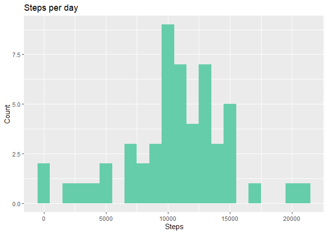
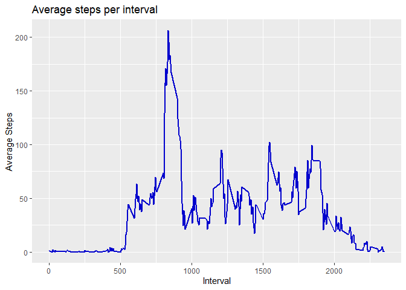
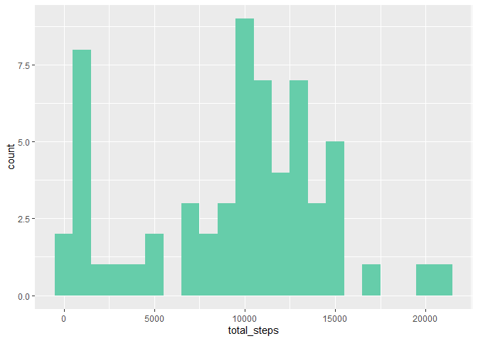
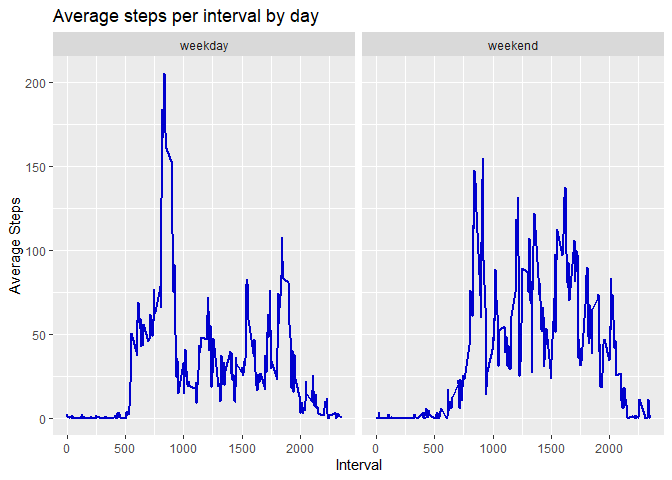

## Loading and preprocessing the data


```r
# Loading tidyverse and related libraries
library(tidyverse)
```

```
## ── Attaching packages ─────────────────────────────────────── tidyverse 1.3.2 ──
## ✔ ggplot2 3.4.0      ✔ purrr   1.0.0 
## ✔ tibble  3.1.8      ✔ dplyr   1.0.10
## ✔ tidyr   1.2.1      ✔ stringr 1.5.0 
## ✔ readr   2.1.3      ✔ forcats 0.5.2 
## ── Conflicts ────────────────────────────────────────── tidyverse_conflicts() ──
## ✖ dplyr::filter() masks stats::filter()
## ✖ dplyr::lag()    masks stats::lag()
```

```r
library(dplyr)
library(readr)
library(janitor)
```

```
## 
## Attaching package: 'janitor'
## 
## The following objects are masked from 'package:stats':
## 
##     chisq.test, fisher.test
```

```r
library(ggplot2)

df = read_csv("activity.csv", na=c("NA"), col_names = TRUE)
```

```
## Rows: 17568 Columns: 3
## ── Column specification ────────────────────────────────────────────────────────
## Delimiter: ","
## dbl  (2): steps, interval
## date (1): date
## 
## ℹ Use `spec()` to retrieve the full column specification for this data.
## ℹ Specify the column types or set `show_col_types = FALSE` to quiet this message.
```

After loading data, we can now examine data


```r
head(df)
```

```
## # A tibble: 6 × 3
##   steps date       interval
##   <dbl> <date>        <dbl>
## 1    NA 2012-10-01        0
## 2    NA 2012-10-01        5
## 3    NA 2012-10-01       10
## 4    NA 2012-10-01       15
## 5    NA 2012-10-01       20
## 6    NA 2012-10-01       25
```


```r
nrow(df)
```

```
## [1] 17568
```


```r
summary(df)
```

```
##      steps             date               interval     
##  Min.   :  0.00   Min.   :2012-10-01   Min.   :   0.0  
##  1st Qu.:  0.00   1st Qu.:2012-10-16   1st Qu.: 588.8  
##  Median :  0.00   Median :2012-10-31   Median :1177.5  
##  Mean   : 37.38   Mean   :2012-10-31   Mean   :1177.5  
##  3rd Qu.: 12.00   3rd Qu.:2012-11-15   3rd Qu.:1766.2  
##  Max.   :806.00   Max.   :2012-11-30   Max.   :2355.0  
##  NA's   :2304
```

We can see that there are missing values in `steps` column

## What is mean total number of steps taken per day?

First we calculate total steps per each day


```r
df_per_day = df %>% 
  drop_na() %>% 
  group_by(date) %>% 
  summarise(total_steps = sum(steps))

head(df_per_day)
```

```
## # A tibble: 6 × 2
##   date       total_steps
##   <date>           <dbl>
## 1 2012-10-02         126
## 2 2012-10-03       11352
## 3 2012-10-04       12116
## 4 2012-10-05       13294
## 5 2012-10-06       15420
## 6 2012-10-07       11015
```

Histogram of the steps per day


```r
df_per_day %>% ggplot(aes(x=total_steps)) + 
  geom_histogram(binwidth = 1000, fill="aquamarine3") +
  labs(title="Steps per day", x="Steps", y="Count")
```

<!-- -->

We can calculate the mean and the median


```r
df_per_day %>% 
  summarise(mean_steps_per_day = mean(total_steps), median_steps_per_day=median(total_steps))
```

```
## # A tibble: 1 × 2
##   mean_steps_per_day median_steps_per_day
##                <dbl>                <dbl>
## 1             10766.                10765
```

## What is the average daily activity pattern?

Calculating the mean steps for each 5-minute interval across all days and plot


```r
df_per_interval = df %>% 
  drop_na() %>% 
  group_by(interval) %>% 
  summarise(average_steps =mean(steps))

df_per_interval %>% ggplot(aes(interval, average_steps)) +
  geom_line(color="blue3", size=.8) +
  labs(title="Average steps per interval", x="Interval", y="Average Steps")
```

```
## Warning: Using `size` aesthetic for lines was deprecated in ggplot2 3.4.0.
## ℹ Please use `linewidth` instead.
```

<!-- -->

The 5-minute interval with maximum average steps can be found as:


```r
df_per_interval %>% filter(average_steps==max(df_per_interval$average_steps))
```

```
## # A tibble: 1 × 2
##   interval average_steps
##      <dbl>         <dbl>
## 1      835          206.
```

## Imputing missing values

Total number of rows with missing values:


```r
df %>% is.na() %>% sum()
```

```
## [1] 2304
```

As we found out earlier in exploring data, all these missing values are from `steps`. An appropriate way of imputing missing steps would be using the medain of each 5 minute interval


```r
df_filled = df %>% 
  group_by(interval) %>% 
  mutate(steps = if_else(is.na(steps), 
                            median(steps, na.rm = TRUE), 
                            steps))

head(df_filled)
```

```
## # A tibble: 6 × 3
## # Groups:   interval [6]
##   steps date       interval
##   <dbl> <date>        <dbl>
## 1     0 2012-10-01        0
## 2     0 2012-10-01        5
## 3     0 2012-10-01       10
## 4     0 2012-10-01       15
## 5     0 2012-10-01       20
## 6     0 2012-10-01       25
```

Histogram of steps per day with missing data filled dataset


```r
df_filled_day = df_filled %>% 
  group_by(date) %>% 
  summarise(total_steps = sum(steps))

df_filled_day %>% ggplot(aes(total_steps)) +
  geom_histogram(binwidth = 1000, fill="aquamarine3")
```

<!-- -->

The mean and the median


```r
df_filled_day %>% 
  summarise(mean_steps_per_day = mean(total_steps), median_steps_per_day=median(total_steps))
```

```
## # A tibble: 1 × 2
##   mean_steps_per_day median_steps_per_day
##                <dbl>                <dbl>
## 1              9504.                10395
```

**From the histogram and the mean/median statistics we can see the dataset with imputed missing values differ from the original dataset. There is a increase in the count of the histogram in the lower end. Further, mean and the median has decreased that the original dataset, indicating the imputed values are low value and in greater count.**

## Are there differences in activity patterns between weekdays and weekends?

Add a new column to indicate weekdays and weekends


```r
df_filled_day = df_filled %>% 
  mutate(day=if_else(weekdays(date)!="Saturday" & (weekdays(date)!="Sunday"),"weekday","weekend")) %>% 
  mutate(day=as.factor(day))

head(df_filled_day)
```

```
## # A tibble: 6 × 4
## # Groups:   interval [6]
##   steps date       interval day    
##   <dbl> <date>        <dbl> <fct>  
## 1     0 2012-10-01        0 weekday
## 2     0 2012-10-01        5 weekday
## 3     0 2012-10-01       10 weekday
## 4     0 2012-10-01       15 weekday
## 5     0 2012-10-01       20 weekday
## 6     0 2012-10-01       25 weekday
```


```r
df_filled_day %>% 
  group_by(interval, day) %>% 
  summarize(avg_steps = mean(steps)) %>% 
  ggplot(aes(interval, avg_steps)) +
  geom_line(color="blue3", size=.8) +
  facet_wrap(~day) +
  labs(title="Average steps per interval by day", x="Interval", y="Average Steps")
```

```
## `summarise()` has grouped output by 'interval'. You can override using the
## `.groups` argument.
```

<!-- -->

**According to the plots, during weekdays average steps in the mid-day hours are lower than that of weekend. Also there is higher peak in the early hours during weekdays**
