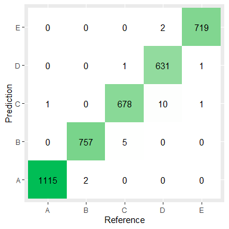

## Executive Summary

This is a machine learning model building project using R, on a weight
lifting exercise dataset to predict the performance or how well exercise
were performed. This report contains the how the prediction model was
built, how cross validation was used, what the expected out of sample
error would be, and how the prediction model was used to predict 20
special test cases.

## Background

Using wearable devices it is now possible to collect a large amount of
data about personal activity relatively inexpensively. The data used
here were compiled by a group of enthusiasts who took measurements about
themselves regularly to improve their health, to find patterns in their
behavior. In this project, your goal will be to use data from
accelerometers on the belt, forearm, arm, and dumbell of 6 participants.
They were asked to perform barbell lifts correctly and incorrectly in 5
different way. The measurements have been recorded with a label -
`classe`, to indicate how well the exercise was peformed.

### Source Data

The training data for this project are available here:

<https://d396qusza40orc.cloudfront.net/predmachlearn/pml-training.csv>

The unlabeled test data are available here:

<https://d396qusza40orc.cloudfront.net/predmachlearn/pml-testing.csv>

More information about the dataset for this project is available in this
source:
<http://web.archive.org/web/20161224072740/http:/groupware.les.inf.puc-rio.br/har>
(see the section on the Weight Lifting Exercise Dataset).

## Loading and Exploring Data

### Loading Libraries and Data


```r
library(dplyr)
library(readr)
library(tidyr)
library(tibble)
library(ggplot2)
library(caret)

# The dataset that will be used to train an evaluate models
wle_data = read_csv("pml-training.csv", na=c("","NA", "#DIV/0!")) %>% select(-c("...1"))
# The unlabled dataset that we need to predict in the end.
wle_test_data = read_csv("pml-testing.csv") %>% select(-c("...1"))
```

### Exploring Data


```r
c(dim(wle_data), dim(wle_test_data))
```

```
## [1] 19622   159    20   159
```

The dataset we work with has 19622 records and the test set has 20
records, with 159 columns in each (first column containing row number
was dropped)


```r
wle_data %>% select(classe) %>% table()
```

```
## classe
##    A    B    C    D    E 
## 5580 3797 3422 3216 3607
```

When we look in to the response variable, `classe`, we can see there are
5 classes. Each seems to be on same scale but unequal number of data
points. However, the class imbalance is in an acceptable range. Up
scaling or down sampling is not necessary to balance them out.

### Missing Values

We can check the columns with missing values.


```r
na_list = wle_data %>% is.na() %>% colSums() %>% data.frame() %>% tibble::rownames_to_column(var = "feature") %>% rename("NAs"=".") %>% filter(NAs>0) %>% arrange(NAs)
nrow(na_list)
```

```
## [1] 100
```

There are 100 columns that have missing values.


```r
head(na_list)
```

```
##                feature   NAs
## 1        max_roll_belt 19216
## 2       max_picth_belt 19216
## 3        min_roll_belt 19216
## 4       min_pitch_belt 19216
## 5  amplitude_roll_belt 19216
## 6 amplitude_pitch_belt 19216
```

Lowest number of non-zero missing values in a column is 19216 out of
19622 total values. We can say these columns contain almost entirely
missing values. Hence, hardly any way of imputing missing values and we
can drop these columns. We should apply the same transformation to the
test set as well.


```r
wle_data2 = wle_data %>% select(-c(na_list$feature))
wle_test_data2 = wle_test_data %>% select(-c(na_list$feature))
```

### Unrelated Features

Examining the column names:


```r
wle_data2 %>% colnames()
```

```
##  [1] "user_name"            "raw_timestamp_part_1" "raw_timestamp_part_2"
##  [4] "cvtd_timestamp"       "new_window"           "num_window"          
##  [7] "roll_belt"            "pitch_belt"           "yaw_belt"            
## [10] "total_accel_belt"     "gyros_belt_x"         "gyros_belt_y"        
## [13] "gyros_belt_z"         "accel_belt_x"         "accel_belt_y"        
## [16] "accel_belt_z"         "magnet_belt_x"        "magnet_belt_y"       
## [19] "magnet_belt_z"        "roll_arm"             "pitch_arm"           
## [22] "yaw_arm"              "total_accel_arm"      "gyros_arm_x"         
## [25] "gyros_arm_y"          "gyros_arm_z"          "accel_arm_x"         
## [28] "accel_arm_y"          "accel_arm_z"          "magnet_arm_x"        
## [31] "magnet_arm_y"         "magnet_arm_z"         "roll_dumbbell"       
## [34] "pitch_dumbbell"       "yaw_dumbbell"         "total_accel_dumbbell"
## [37] "gyros_dumbbell_x"     "gyros_dumbbell_y"     "gyros_dumbbell_z"    
## [40] "accel_dumbbell_x"     "accel_dumbbell_y"     "accel_dumbbell_z"    
## [43] "magnet_dumbbell_x"    "magnet_dumbbell_y"    "magnet_dumbbell_z"   
## [46] "roll_forearm"         "pitch_forearm"        "yaw_forearm"         
## [49] "total_accel_forearm"  "gyros_forearm_x"      "gyros_forearm_y"     
## [52] "gyros_forearm_z"      "accel_forearm_x"      "accel_forearm_y"     
## [55] "accel_forearm_z"      "magnet_forearm_x"     "magnet_forearm_y"    
## [58] "magnet_forearm_z"     "classe"
```

We can see `user_name`, `raw_timestamp_part_1`, `raw_timestamp_part_2`,
`cvtd_timestamp`, `new_window`, and `num_window` are not actually sensor
measurements. They can be removed from the datasets.


```r
wle_data2 = wle_data2 %>% 
  select(-c("user_name", "raw_timestamp_part_1","raw_timestamp_part_2", "cvtd_timestamp", "new_window", "num_window"))
wle_test_data2 = wle_test_data2 %>% 
  select(-c("user_name", "raw_timestamp_part_1","raw_timestamp_part_2", "cvtd_timestamp", "new_window", "num_window"))
```

### Data Types

Checking the data types of columns:


```r
wle_data2 %>% select(!where(is.numeric)) %>% colnames()
```

```
## [1] "classe"
```

we can see except for the output variable `classe`, all other columns
are numeric. Since, `classe` is a categorical variable, we can convert
it to factor type


```r
wle_data2 = wle_data2 %>% mutate(classe=as.factor(classe))
```

Dimensions of our working dataset after processing would be:


```r
dim(wle_data2)
```

```
## [1] 19622    53
```

52 variables + 1 response, 19622 data points

### Train/test set split and cross validation

We have a separate test set with 20 data points which should be used to
predict in the end of this project which we have stored as
`wle_test_data2` after processing and will be referred to as the quiz
test set. We are going to set it aside until the very end we have a
reasonable model. To train and evaluate the models, we use `wle_data2`.
We will split into training and test sets `80:20` ratio and will use
k-fold cross validation for evaluation. Here, `k=5` is selected so that
folds are not too low or too high. The created test set(not the quiz
test set) will be used to estimate the out of sample error.


```r
set.seed(42)
inTrain = createDataPartition(y=wle_data2$classe, p=0.8, list=FALSE)
training = wle_data2[inTrain, ]
testing = wle_data2[-inTrain, ]

tc = trainControl(method = "cv", number = 5)
```

## Model Building

We are going to use all the features in the dataset.

### Support Vector Machine

We can start model building with a linear classifcation model: SVM


```r
svm_model = train(classe~., method="svmLinear", data = training, trControl=tc)
print(svm_model)
```

```
## Support Vector Machines with Linear Kernel 
## 
## 15699 samples
##    52 predictor
##     5 classes: 'A', 'B', 'C', 'D', 'E' 
## 
## No pre-processing
## Resampling: Cross-Validated (5 fold) 
## Summary of sample sizes: 12561, 12559, 12559, 12558, 12559 
## Resampling results:
## 
##   Accuracy   Kappa    
##   0.7833646  0.7245726
## 
## Tuning parameter 'C' was held constant at a value of 1
```

Averaged cross validation accuracy of default svm model is about 0.787,
which is not bad, but not very good either.

### Random Forest

We will try a random forest as the next model


```r
rf_model = train(classe~., method="rf", data = training, trControl=tc)
print(rf_model)
```

```
## Random Forest 
## 
## 15699 samples
##    52 predictor
##     5 classes: 'A', 'B', 'C', 'D', 'E' 
## 
## No pre-processing
## Resampling: Cross-Validated (5 fold) 
## Summary of sample sizes: 12559, 12558, 12558, 12560, 12561 
## Resampling results across tuning parameters:
## 
##   mtry  Accuracy   Kappa    
##    2    0.9915923  0.9893634
##   27    0.9918470  0.9896855
##   52    0.9867512  0.9832372
## 
## Accuracy was used to select the optimal model using the largest value.
## The final value used for the model was mtry = 27.
```

Random Forest model yields much better average cross validation accuracy
0.992

### Boosting

Although previous model achieved over 99% accuracy, we can still try
boosted tree models.


```r
gbm_model = train(classe~., method="gbm", data = training, trControl=tc, verbose=FALSE)
print(gbm_model)
```

```
## Stochastic Gradient Boosting 
## 
## 15699 samples
##    52 predictor
##     5 classes: 'A', 'B', 'C', 'D', 'E' 
## 
## No pre-processing
## Resampling: Cross-Validated (5 fold) 
## Summary of sample sizes: 12560, 12558, 12560, 12559, 12559 
## Resampling results across tuning parameters:
## 
##   interaction.depth  n.trees  Accuracy   Kappa    
##   1                   50      0.7564177  0.6909850
##   1                  100      0.8202432  0.7724464
##   1                  150      0.8535576  0.8146441
##   2                   50      0.8546408  0.8157990
##   2                  100      0.9070643  0.8824006
##   2                  150      0.9298688  0.9112549
##   3                   50      0.8980188  0.8708821
##   3                  100      0.9412068  0.9256011
##   3                  150      0.9612716  0.9509993
## 
## Tuning parameter 'shrinkage' was held constant at a value of 0.1
## 
## Tuning parameter 'n.minobsinnode' was held constant at a value of 10
## Accuracy was used to select the optimal model using the largest value.
## The final values used for the model were n.trees = 150, interaction.depth =
##  3, shrinkage = 0.1 and n.minobsinnode = 10.
```

Accuracy of boosted tree model is 0.96, bit lower compared to random
forest model.

### Stacked Model

Now we can try to combine above three models and see if it can results
even better.


```r
pred_train_svm = predict(svm_model, newdata = training)
pred_train_rf = predict(rf_model$finalModel, newdata = training)
pred_train_gbm = predict(gbm_model$finalModel, newdata = training)
```

```
## Using 150 trees...
```

```r
interm_data = data.frame(svm = pred_train_svm, rf = pred_train_rf, gbmm = pred_train_gbm, classe = training$classe)

comb_model = train(classe~., method="rf",data = interm_data, trControl=tc)
print(comb_model)
```

```
## Random Forest 
## 
## 15699 samples
##     7 predictor
##     5 classes: 'A', 'B', 'C', 'D', 'E' 
## 
## No pre-processing
## Resampling: Cross-Validated (5 fold) 
## Summary of sample sizes: 12561, 12560, 12558, 12559, 12558 
## Resampling results across tuning parameters:
## 
##   mtry  Accuracy   Kappa    
##    2    1.0000000  1.0000000
##    7    1.0000000  1.0000000
##   13    0.9999363  0.9999195
## 
## Accuracy was used to select the optimal model using the largest value.
## The final value used for the model was mtry = 2.
```

The combined model has achieved 100% accuracy. Hence we can choose the
combined model as our final candidate.

## Expected Out of Sample Error

No matter how accurate our predictions over the training and cross
validation folds, we should always check against test set to estimate
the out of sample error of the model, since our model could be
overfitting.


```r
pred_test_svm = predict(svm_model, newdata = testing)
pred_test_rf = predict(rf_model$finalModel, newdata = testing)
pred_test_gbm = predict(gbm_model$finalModel, newdata = testing)
```

```
## Using 150 trees...
```

```r
interm_data_test = data.frame(svm = pred_test_svm, rf = pred_test_rf, gbmm = pred_test_gbm, classe = testing$classe)

pred_test_comb = predict(comb_model, newdata = interm_data_test)

confusionMatrix(pred_test_comb, testing$classe)
```

```
## Confusion Matrix and Statistics
## 
##           Reference
## Prediction    A    B    C    D    E
##          A 1115    2    0    0    0
##          B    0  757    5    0    0
##          C    1    0  678   10    1
##          D    0    0    1  631    1
##          E    0    0    0    2  719
## 
## Overall Statistics
##                                           
##                Accuracy : 0.9941          
##                  95% CI : (0.9912, 0.9963)
##     No Information Rate : 0.2845          
##     P-Value [Acc > NIR] : < 2.2e-16       
##                                           
##                   Kappa : 0.9926          
##                                           
##  Mcnemar's Test P-Value : NA              
## 
## Statistics by Class:
## 
##                      Class: A Class: B Class: C Class: D Class: E
## Sensitivity            0.9991   0.9974   0.9912   0.9813   0.9972
## Specificity            0.9993   0.9984   0.9963   0.9994   0.9994
## Pos Pred Value         0.9982   0.9934   0.9826   0.9968   0.9972
## Neg Pred Value         0.9996   0.9994   0.9981   0.9964   0.9994
## Prevalence             0.2845   0.1935   0.1744   0.1639   0.1838
## Detection Rate         0.2842   0.1930   0.1728   0.1608   0.1833
## Detection Prevalence   0.2847   0.1942   0.1759   0.1614   0.1838
## Balanced Accuracy      0.9992   0.9979   0.9938   0.9904   0.9983
```

Our model performs 99.36% accuracy on the test set and hence our
estimate of the out of sample error would be so. This is a great level
of performance.

we can plot the confusion matrix:


```r
as.data.frame(confusionMatrix(pred_test_comb, testing$classe)$table) %>% 
  ggplot(aes(x=Reference, y=Prediction)) +
  geom_tile(aes(fill=Freq)) +
  scale_fill_gradient(low = "white", high = "#00bd55") +
  geom_text(aes(label = Freq)) + 
  theme(legend.position = "none")
```

<!-- -->

## Prediction on Quiz Test Cases

Now we can confidently use our model to make prediction on the quiz test
set.


```r
pred_quiz_svm = predict(svm_model, newdata = wle_test_data2)
pred_quiz_rf = predict(rf_model$finalModel, newdata = wle_test_data2)
pred_quiz_gbm = predict(gbm_model$finalModel, newdata = wle_test_data2)
```

```
## Using 150 trees...
```

```r
interm_data_quiz = data.frame(svm = pred_quiz_svm, rf = pred_quiz_rf, gbmm = pred_quiz_gbm)

pred_quiz_comb = predict(comb_model, newdata = interm_data_quiz)

data.frame(problem_id=wle_test_data2$problem_id, classe_prediction = pred_quiz_comb)
```

```
##    problem_id classe_prediction
## 1           1                 B
## 2           2                 A
## 3           3                 B
## 4           4                 A
## 5           5                 A
## 6           6                 E
## 7           7                 D
## 8           8                 B
## 9           9                 A
## 10         10                 A
## 11         11                 B
## 12         12                 C
## 13         13                 B
## 14         14                 A
## 15         15                 E
## 16         16                 E
## 17         17                 A
## 18         18                 B
## 19         19                 B
## 20         20                 B
```

## References & Credits

**All the credits goes to the authors of the paper "Qualitative Activity
Recognition of Weight Lifting Exercises" who have produced the original
dataset.**

Velloso, E.; Bulling, A.; Gellersen, H.; Ugulino, W.; Fuks, H.
Qualitative Activity Recognition of Weight Lifting Exercises.
Proceedings of 4th International Conference in Cooperation with SIGCHI
(Augmented Human '13) . Stuttgart, Germany: ACM SIGCHI, 2013.

[Link to the
paper](http://web.archive.org/web/20170519033209/http://groupware.les.inf.puc-rio.br/public/papers/2013.Velloso.QAR-WLE.pdf)\
[Link to the
website](http://web.archive.org/web/20161224072740/http:/groupware.les.inf.puc-rio.br/har)
